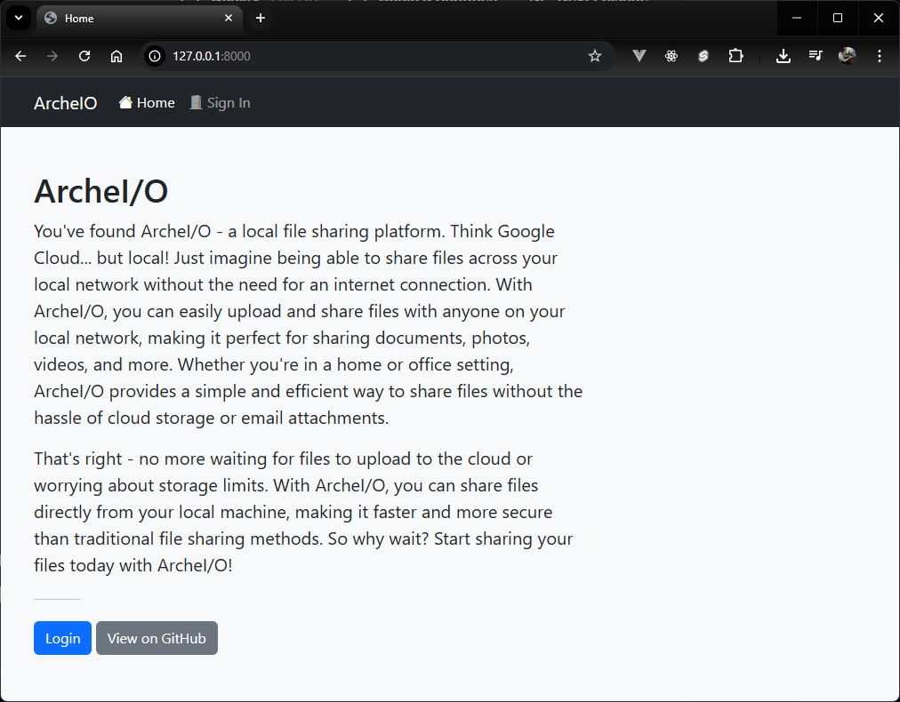
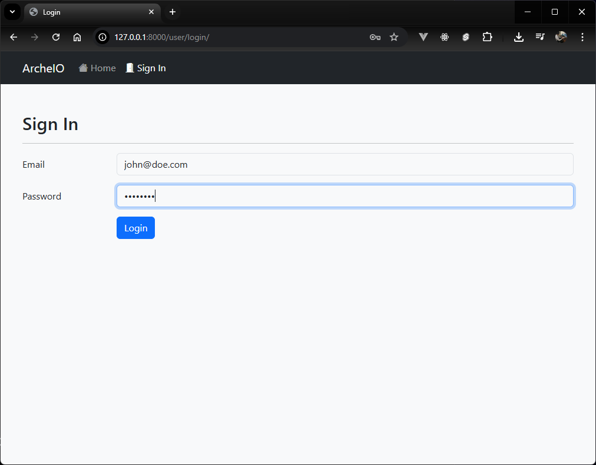
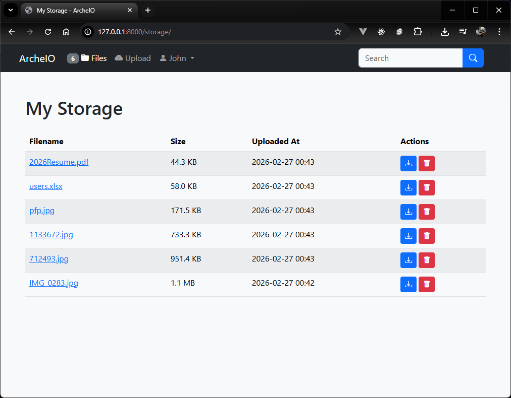
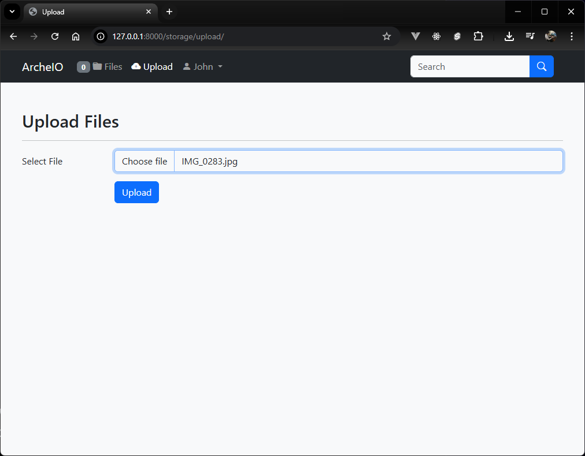
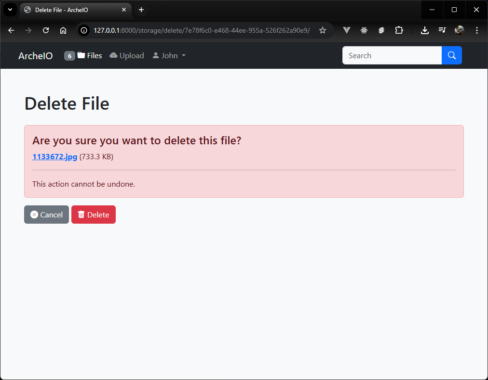
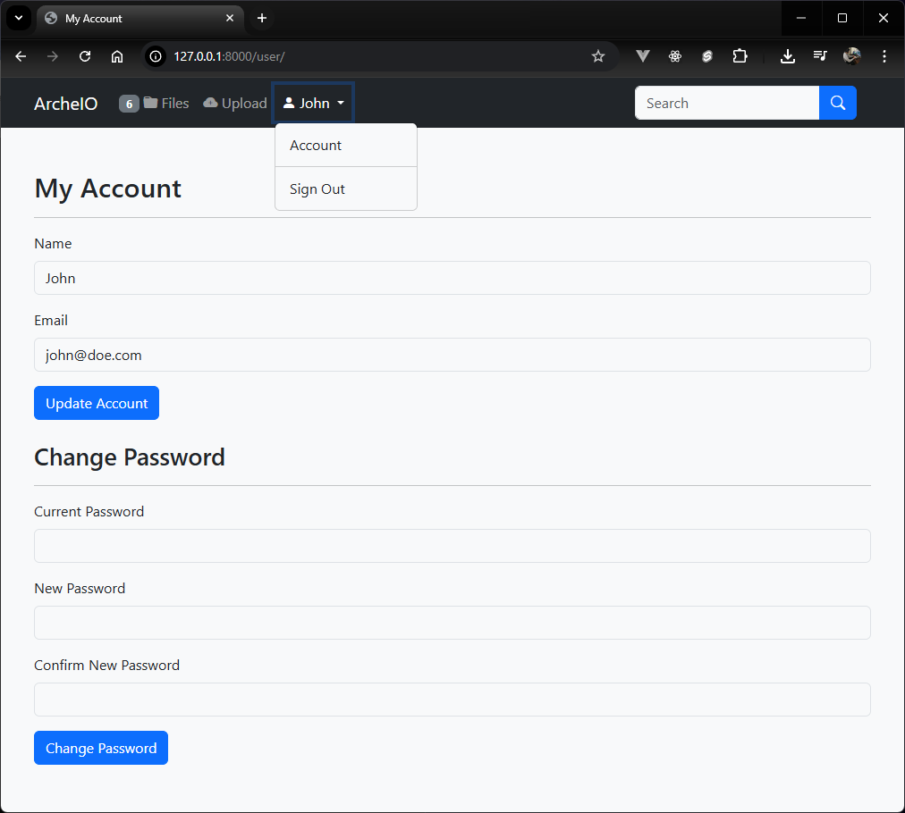
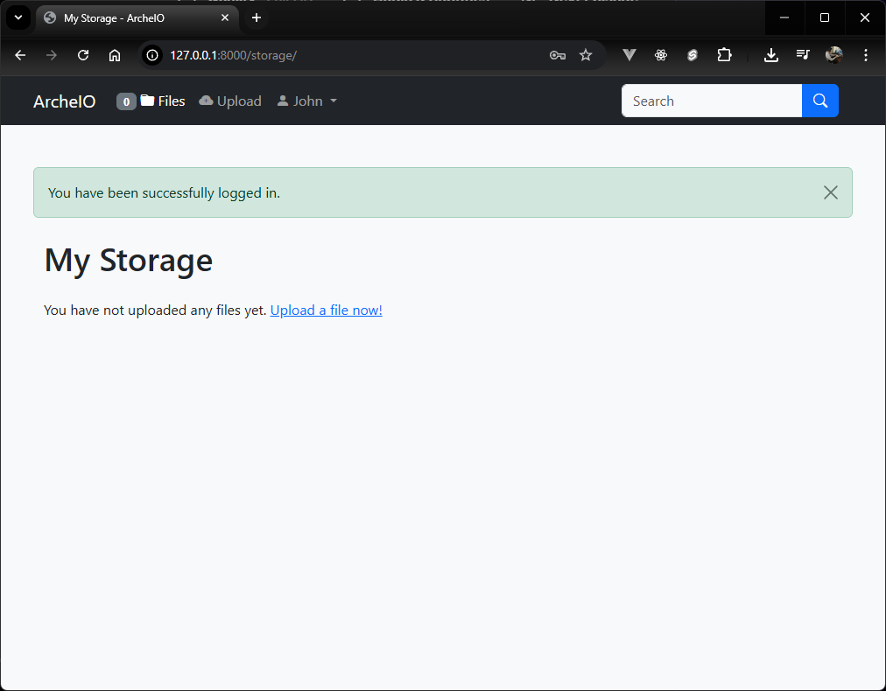

# ArcheI/O

A local file hosting solution. Made purely out of selfish reasons and hence I don't expect it to be used by anyone else.
I don't plan on maintaining this. I don't plan on adding any features. I don't plan on fixing any bugs (if there are any).

So don't bother with your issues and pull requests. I won't be looking at them. It's MIT licensed, so fork it and fuck around.

## Installation

It's as easy as 1...2...3...4...and 5!

1. Create a new virtual environment.
2. Install dependencies.
3. Collect static files.
4. Create an `.env` files with required variables.
5. Run the server.

```shell
# Install dependencies
pip install -r requirements.txt

# Collect static files
./manage.py collectstatic --noinput

# Setup env variables
cat <<EOF > .env
DEBUG=False
SECRET_KEY=<some_random_string>
EOF

# Run server
gunicorn backend.wsgi --bind <your_ip>:<port>
```

## Screenshots








